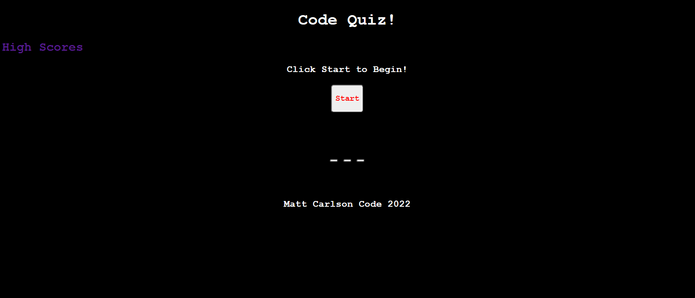

# code-quiz-training

## Description - 
This is a quiz to help new software developers refine their memory with questions based around JavaScript.  

It was a new challenge, JavaScript is a new language for me that I am trying to navigate.  I actually rewrote several massive parts of my code.  For the visual aesthetic, I chose Courier New as the main font because I wanted to go for a clean, simple look.  

This assignment taught me a lot about time management and problem solving.  It definitely provided the framework as I continue to adapt and retool my studying and learning style to this bootcamp.  

That being said, it was interesting seeing all the different options that JavaScript has to offer.  I'm looking forward to receiving feedback and learning more.

## Contributors -
I did the editing, and received help from classmates Sam and Jake.  In addition I received help from BCS Tutors Manan, Diana, Tyler, Erik, Jake, and Royce.  Office hours were also essential for help from my instructor John and TA Michael.

# Usage -
If you would like to try the quiz, you can find it at https://mrmrc182.github.io/code-quiz-training/

To start the quiz, click the "start" button.  Then answer the questions.  You will be presented with a score at the end of the game, as well as an option to input your initials for what is supposed to be a high score tracker.  There is a page listing some high scores linked as well.

See the screenshot below as a visual reference.

## License -
Matt Carlson Code 2022